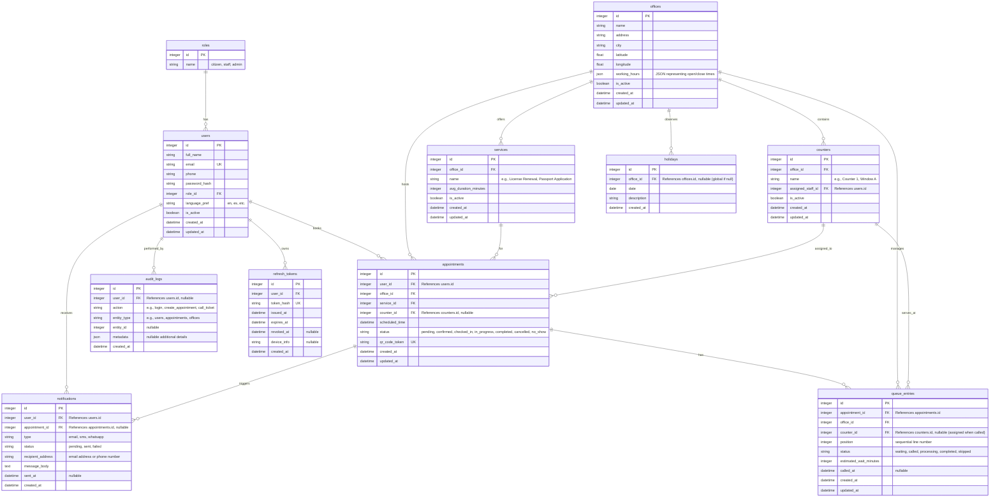

# QFlow — ER Diagram

This document contains the Entity-Relationship (ER) diagram for the QFlow Database. It defines the schemas, columns, types, and relationships.

## Mermaid ER Diagram

## Propose Schema Enhancements (Beyond Locked Baseline)

The following changes are added to support practical implementation:
1. **`users.updated_at` / `offices.updated_at` / `counters.updated_at` / `services.updated_at` / `appointments.updated_at` / `queue_entries.updated_at`**: Added standard modification tracking for data integrity and cache invalidation.
2. **`refresh_tokens` Table**: Required for secure, stateless JWT authentication with token rotation.
3. **`queue_entries.counter_id`**: Added to track which counter called the ticket, resolving where the customer should report.
4. **`queue_entries.status`**: Explicitly enumerated values (`waiting`, `called`, `processing`, `completed`, `skipped`).
5. **`notifications.recipient_address` & `message_body`**: Included to capture the actual contact point and body content at queuing time.
6. **`holidays.office_id` (Nullable)**: Allows defining a "global holiday" (applies to all offices if `office_id` is null) or "office-specific holiday" (applies to a single office).
